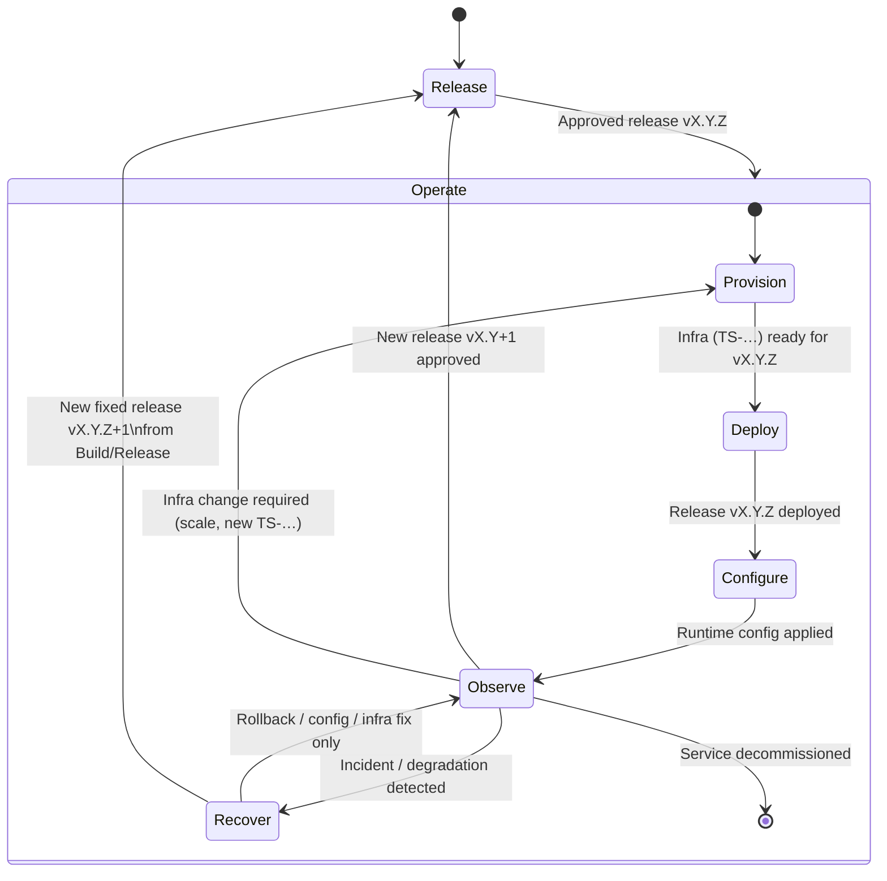

# Agent‑Oriented Project Template

## 1. High‑Level Vision

This repository is a **project template** designed for specification‑driven
development, usable by humans and AI agents.

Main files and directories:

- `docs/`: product and technical documentation structured by phase:
  - `00_vision/`: vision, scoping, context.
  - `01_product/`: functional specification (`specifications.md`) and roadmap (`ROADMAP.md`).
  - `02_design/`: functional, software and technical design, data model, tech stack.
  - `03_delivery/plan_X.Y.md`: per‑version plans with batches (`LOT-…`) and testing strategy.
  - `04_operations/`: deployment, configuration, monitoring, incidents.
- `CONVENTIONS.md`: working processes + common format/quality standards.
- `AGENTS.md`: agent constitution (how to read `docs/`, use `FEAT/BF/LS/TS/LOT`, etc.).
- `src/`: application code.
- `infra/`: infrastructure as code and CI/CD configuration.
- `tests/`: automated test suites.

Logical pipeline driven by documentation:

> Vision → Product → Design → Plan → Code → Operate

This framework can be used either with a **human orchestrator** or with an
**AI orchestrator** (or a mix of both). Section **4. Usage** describes these
two orchestration modes and how they drive the Build / Release / Operate flows.

Core artefact types (see `AGENTS.md` for the formal index):

- `FEAT-…` — Features (product capabilities).  
- `BF-…` — Business (functional) blocks.  
- `LS-…` — Logical software subsystems.  
- `TS-…` — Technical artefacts (clusters, pipelines, brokers, …).  
- `IF-BF-…` — Functional interfaces between `BF` blocks.  
- `IF-LS-…` — Software interfaces between `LS` subsystems.  
- `IF-TS-…` — Technical interfaces (channels, endpoints, topics…) linked to `TS`.  
- `LOT-…` — Delivery batches grouping FEAT/LS/TS for a given version.

The framework requires **every artefact to be explicitly typed** with one of
these IDs, and the documentation (`docs/01_product`, `docs/02_design`,
`docs/03_delivery`, `docs/04_operations`) to maintain an **exhaustive index
of all artefacts of the target service**, across **Build**, **Release**
and **Operate** activities. Managing this index is **mandatory**:
no artefact may be created or changed without being properly referenced
in the right view.

This index is distributed per activity:

- product view (`docs/01_product`) → FEAT and roadmap entries per version,  
- functional view (`docs/02_design/functional_architecture.md`) → BF and `IF-BF-…`,  
- software view (`docs/02_design/software_architecture.md`) → LS and `IF-LS-…`,  
- technical / operations view (`docs/02_design/technical_architecture.md`, `docs/04_operations/*`) → TS and `IF-TS-…`, deployment/config/monitoring/incident procedures,  
- delivery view (`docs/03_delivery/plan_X.Y.md`) → LOT and their FEAT/LS/TS/IF-* scope per version and per batch.

These typed artefacts and their index are described in `docs/` and
`CONVENTIONS.md`, and serve as structured inputs for both humans and agents
at every step of the Build / Release / Operate flows.

---

## 2. Documentation Structure & Artefacts

- **00_vision**  
  - `product_brief.md`: vision, value proposition, positioning.  
  - `project_scoping_note.md`: objectives, context, constraints.

- **01_product**  
  - `specifications.md`: actors, business concepts, FEAT (`FEAT-…`).  
  - `ROADMAP.md`: product view by version (`X.Y`) and associated FEAT.  
  - `features/*.md`: per‑feature details.

- **02_design**  
  - `functional_architecture.md`: business/functional blocks (`BF-…`) + functional interfaces.  
  - `software_architecture.md`: logical subsystems (`LS-…`) + software interfaces.  
  - `technical_architecture.md`: technical artefacts (`TS-…`) + technical interfaces.  
  - `tech_stack.md`: global stack and per‑`LS`/`TS` stack.  
  - `data_model.md`: data structures.  
  - `c4/`: optional directory dedicated to C4‑model software design.

- **03_delivery**  
  - `plan_X.Y.md`: for each version `X.Y`, batches (`LOT-…`), versions `X.Y.Z`, criticality, testing strategy.

- **04_operations**  
  - `deployment.md`: targets, environments, pipelines.  
  - `configuration.md`, `security.md`, `monitoring.md`, `incident_resolution.md`.

- **CONVENTIONS.md**  
  - General processes (docs → plan → implementation → tests).  
  - 8 process use cases (feature, bug, infra, release, incident, rollback, etc.).  
  - Roles (Orchestrator, Dev, QA, Infra/Operations) and formatting standards.

- **AGENTS.md**  
  - How agents read `docs/` and `CONVENTIONS.md`.  
  - How they use `FEAT/BF/LS/TS/LOT` in practice.

---

## 3. Processes — Overview

Project activities are organised into three main flows:

- **Build** (create and evolve the product)
  - Vision → clarify the “why” and the context.  
  - Product → describe features (`FEAT-…`) and the roadmap.  
  - Design → structure the system into `BF` / `LS` / `TS` and interfaces (`IF-*`).  
  - Plan → organise the work into `LOT-…` per version (`plan_X.Y.md`).  
  - Code → implement the LOT artefacts in `src/` and `tests/`.  

- **Release** (promote build artefacts into deployable releases)
  - Select → choose a candidate version `vX.Y.Z` produced by the Build flow.  
  - Qualify → ensure it meets quality / performance / security / compliance criteria.  
  - Schedule → decide where and when to roll it out (environments, strategy).  
  - Approve → formally approve the release for operations (can map to a `LOT-REL-…`).  

- **Operate** (run and manage an approved release)
  - Provision → create / update technical artefacts (`TS-…`) and base infrastructure.  
  - Deploy → deploy an approved release (`vX.Y.Z`) to environments.  
  - Configure → apply and adjust runtime configuration (settings, secrets, feature flags).  
  - Observe → monitor health and behaviour (metrics, logs, traces, alerts, dashboards).  
  - Recover → investigate incidents and apply fixes or rollbacks, typically via dedicated `LOT-OPS-…` batches.


  ```mermaid
  stateDiagram-v2
      [*] --> Build

      state Build {
          [*] --> Vision

          Vision --> Product: Product vision clarified
          Product --> Design: FEAT-… identified / ROADMAP drafted
          Design --> Plan: BF / LS / TS / IF-* structured
          Plan --> Code: LOT-… defined in plan_X.Y.md
          Code --> [*]: Release candidate vX.Y.Z built & tagged\n(tests OK)

          %% Evolution loops inside Build
          Product --> Vision: Strategy / scope change
          Design --> Product: New FEAT / constraints
          Plan --> Design: Architecture / scope adjustment
          Code --> Plan: Re-plan required (scope or risk)
      }

      %% Exit from Build to the Release flow
      Build --> Release: Release candidate vX.Y.Z
  ```



### 3.1 Details — Build & Operate Activities

The tables below summarise the main activities, artefacts and entry points
for each flow.

**Build flow — from Vision to Code**

| Phase    | Purpose                                            | Input artefacts                                      | Output artefacts                                      | Main roles                    |
|----------|----------------------------------------------------|------------------------------------------------------|-------------------------------------------------------|-------------------------------|
| Vision   | Clarify why the product exists and its context     | External context, strategy, constraints, existing `docs/00_vision/product_brief.md` and `project_scoping_note.md` | Updated `docs/00_vision/product_brief.md` and `project_scoping_note.md` with clarified vision/scoping | Product / Stakeholders (Human) |
| Product  | Describe actors, business concepts and FEAT        | Vision docs, existing `docs/01_product/specifications.md` and `ROADMAP.md` | Updated `docs/01_product/specifications.md`, `ROADMAP.md`, created/updated `FEAT-…` and roadmap entries (`X.Y`) | Product, Domain, Orchestrator |
| Design   | Structure the system into BF / LS / TS and IF-*    | Vision + Product docs, existing design docs in `docs/02_design/*` | Updated `docs/02_design/functional_architecture.md`, `software_architecture.md`, `technical_architecture.md`, `tech_stack.md`, `data_model.md`, created/updated `BF-…`, `LS-…`, `TS-…`, `IF-BF/IF-LS/IF-TS`, initial skeletons of `docs/04_operations/deployment.md`, `configuration.md`, `monitoring.md`, `incident_resolution.md`, `security.md` | Architect, Dev, Orchestrator  |
| Plan     | Organise work into delivery batches per version    | Roadmap (`X.Y`), existing `BF-…` / `LS-…` / `TS-…` / `IF-*` definitions from `docs/02_design/*`, existing `docs/03_delivery/plan_X.Y.md` | Updated `docs/03_delivery/plan_X.Y.md`, with `LOT-…` and their FEAT/LS/TS/IF-* scope | Orchestrator                  |
| Code     | Implement behaviour and local tests for the LOT    | `LOT-…`, design docs (BF/LS/TS/IF-*), tech stack, codebase and CI pipeline | Code in `src/`, tests in `tests/`, updated CI config if needed, release candidate `vX.Y.Z` and associated release tags in Git | Dev, QA (with Orchestrator)   |

**Operate flow — from approved release to day‑to‑day operations**

| Phase      | Purpose                                              | Input artefacts                                      | Output artefacts                                     | Main roles              |
|------------|------------------------------------------------------|------------------------------------------------------|------------------------------------------------------|-------------------------|
| Provision  | Prepare / update technical artefacts and infra       | `TS-…` definitions, tech stack, release requirements, existing `docs/02_design/technical_architecture.md`, `tech_stack.md`, `docs/04_operations/deployment.md` | Updated `docs/04_operations/deployment.md`, updated `TS-…` topology (clusters, pipelines, brokers…), infra definitions under `infra/` | Infra / Ops (DevOps/SRE) |
| Deploy     | Deploy an approved release `vX.Y.Z` to environments  | Approved release `vX.Y.Z`, deployment topology, CI/CD configuration, `docs/04_operations/deployment.md` | Deployed release instances, rollout history, updated deployment procedures in `docs/04_operations/deployment.md` | Infra / Ops, Orchestrator |
| Configure  | Apply and adjust runtime configuration               | Deployed release, config policies, security rules, existing `docs/04_operations/configuration.md` and security guidelines | Runtime config (config files, env vars, secrets, flags), updated `docs/04_operations/configuration.md` and security rules | Infra / Ops, App owners   |
| Observe    | Monitor health, performance and usage                | Running system, SLO/SLA targets, existing `docs/04_operations/monitoring.md` | Metrics, logs, traces, dashboards, updated observability runbooks in `docs/04_operations/monitoring.md` | Ops, SRE, Product        |
| Recover    | Handle incidents and rollbacks via `LOT-OPS-…`       | Incident reports/symptoms, telemetry, current config, existing `docs/04_operations/incident_resolution.md`, `security.md` | `LOT-OPS-…`, fixes/rollbacks applied, updated incident runbooks and security procedures, incident records and post‑mortems | Ops, Dev, QA, Orchestrator |

At each step, these docs are not only inputs but **outputs of work**:

- `docs/03_delivery/plan_X.Y.md` is produced and refined by the Plan phase in Build.  
- Files under `docs/04_operations` are produced and refined as Operate activities
  (Provision, Deploy, Configure, Observe, Recover) are performed and improved over time.

All artefacts managed in this repository — documentation (`docs/*`), plans,
code, tests, infra (`infra/`), agent configs (`agents/`) — are subject to the
same lifecycle:

- any change must be done in a dedicated Git branch (per LOT or per coherent change),  
- that branch is reviewed via a PR/MR,  
- and only then merged into the main branch and included in the next release tag.

There is no “out of band” change: updating a plan, an operations procedure or
an infra file is treated exactly like changing application code.

---

## 4. Usage

This template can be used with a human in the lead, an AI orchestrator, or a mix of both.  
In all cases, the Build / Release / Operate flows, the artefact index and the mono‑LOT
Git workflow remain the single reference.

### 4.1 Installation (instantiate the template)

To create a new project from this template, create an empty directory, move into it, then download and run the install script with your own names:

```bash
mkdir my-service
cd my-service
curl -fsSL https://raw.githubusercontent.com/dsissoko/SpecEngine/main/scripts/specengine-new.sh \
  | bash -s -- "My Service" "Acme Corp"
```

The script:
- only needs a project name and an organisation name,
- writes the instantiated template into the current (empty) directory,
- initialises a fresh Git repository in that directory.

For non-interactive usage, you can add `--yes` before the project name. For advanced usage (custom destination, explicit template URL), run `scripts/specengine-new.sh --help`.

### 4.1 Human orchestration

- A human product/tech lead fills or adapts the documentation:
  - `docs/00_vision`, `docs/01_product`, `docs/02_design`, `CONVENTIONS.md`, `AGENTS.md`.
- For a target version `X.Y`, the lead creates or updates `docs/03_delivery/plan_X.Y.md`
  and defines `LOT-…` with their FEAT/LS/TS/IF-* scope and criticality.
- For each active LOT, the lead:
  - creates a dedicated Git branch (`lot/X.Y.Z-XXX`),  
  - implements the required changes in `src/`, `tests/`, `infra/`,  
  - keeps the artefact index up to date in `docs/*`.
- CI/CD and releases are configured so that tags `vX.Y.Z` trigger pipelines, deploy
  candidates and releases, using `docs/04_operations/*` as the reference for operations.

### 4.2 Agent orchestration

- An “orchestrator” agent (e.g. Codex) is configured with this repository and instructed to:
  - always read `README.md`, `AGENTS.md`, `CONVENTIONS.md` first,  
  - respect the closed list of artefact types and the Build / Release / Operate FSMs,  
  - maintain the artefact index in `docs/01_product`, `docs/02_design`,
    `docs/03_delivery`, `docs/04_operations`,  
  - work mono‑LOT and propose, rather than execute, Git commands (branch, commit, tag).
- Typical interaction pattern:
  1. The user states the flow and step, e.g.  
     “Flow Build / step Design for version 0.1: apply what the README describes.”  
  2. The agent identifies the current FSM state, lists the impacts on `docs/*`,
     `src/`, `tests/`, `infra/`, then applies the changes.  
  3. The agent outputs the Git commands to run on the LOT branch and a PR/MR summary
     describing the changes and the updated artefact index.
- Higher‑level platforms (GitHub/GitLab, issue trackers, CI/CD) remain optional glue
  around this core: the structure (docs + CONVENTIONS + AGENTS + LOTs) is tool‑agnostic.
